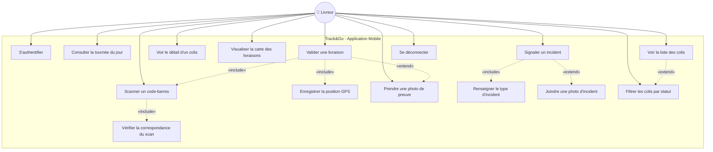
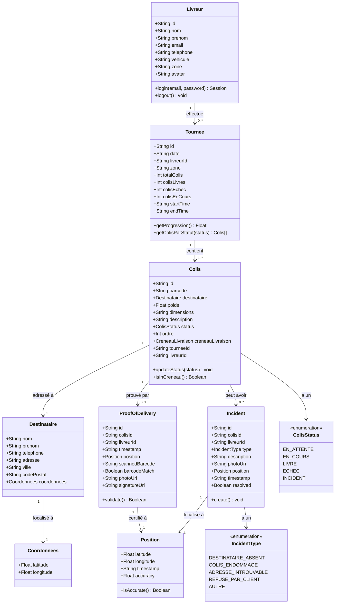
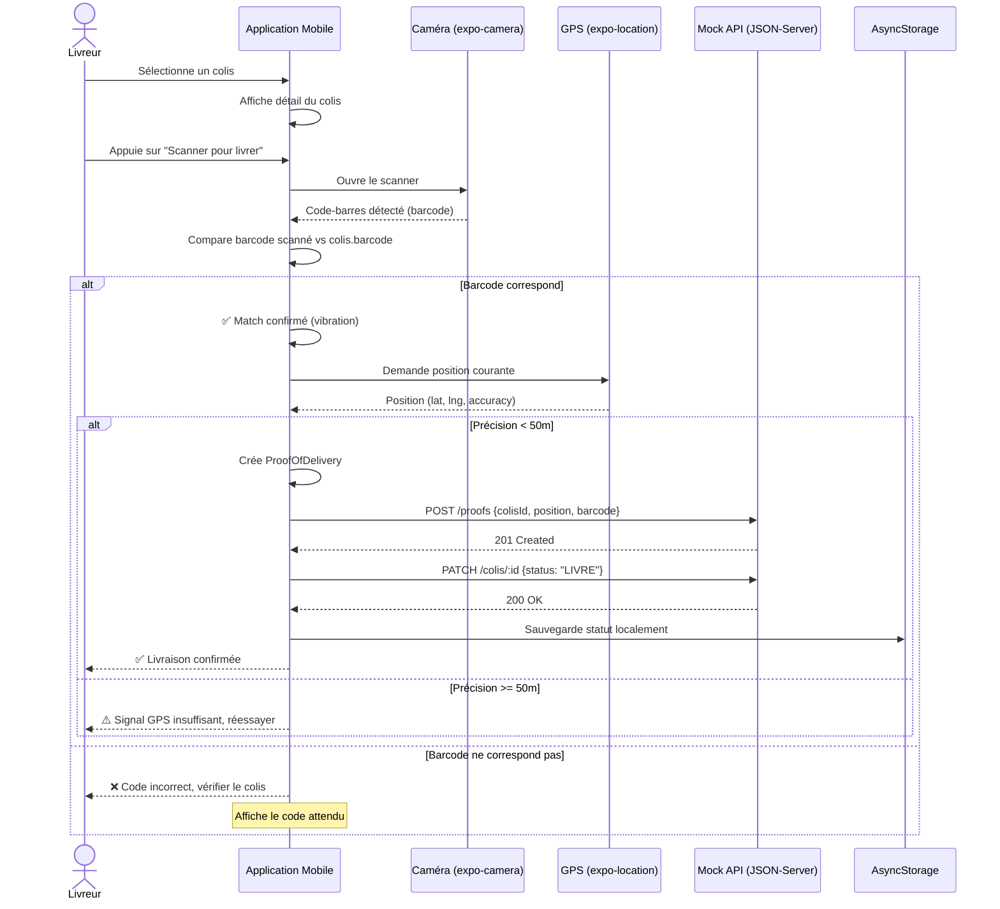
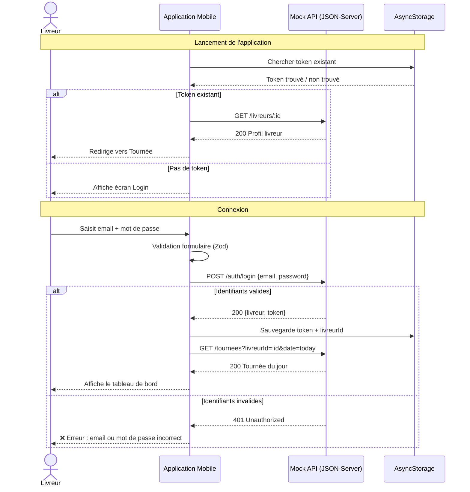
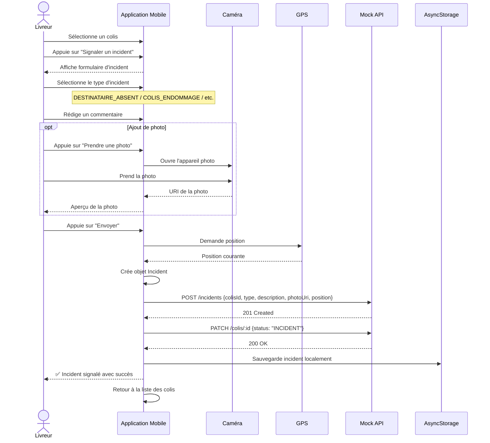
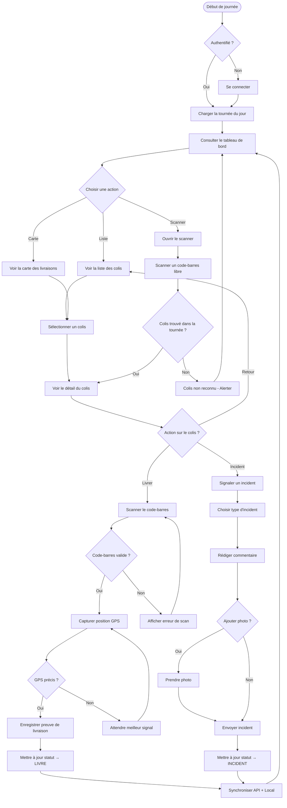
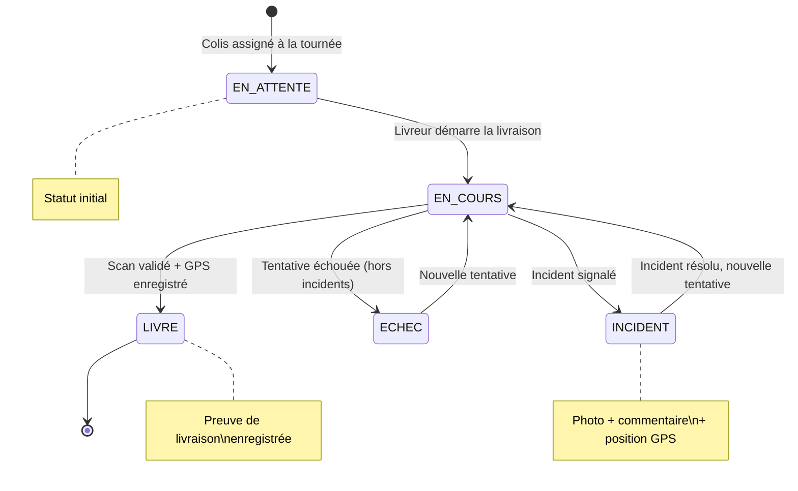

# Conception UML — Track&Go

---

## 1) Diagramme de Cas d'Utilisation (Use Case)

---

## 2) Description des Cas d'Utilisation

### Acteur : Livreur

| # | Cas d'utilisation | Description | Préconditions | Postconditions |
|---|-------------------|-------------|---------------|----------------|
| UC1 | S'authentifier | Connexion avec email/mot de passe | Aucune | Session active, accès à la tournée |
| UC2 | Consulter la tournée | Voir le résumé de la journée (stats, progression) | Être authentifié | Tableau de bord affiché |
| UC3 | Voir la liste des colis | Afficher tous les colis de la tournée en FlatList | Être authentifié | Liste des colis visible |
| UC4 | Voir le détail d'un colis | Consulter toutes les informations d'un colis | UC3 complété | Fiche détaillée affichée |
| UC5 | Visualiser la carte | Voir les points de livraison sur une carte interactive | Être authentifié | Carte avec marqueurs affichée |
| UC6 | Scanner un code-barres | Utiliser la caméra pour lire le code du colis | Permission caméra accordée | Code-barres lu et vérifié |
| UC7 | Vérifier correspondance | Comparer le scan avec le barcode attendu du colis | UC6 complété | Match confirmé ou alerte erreur |
| UC8 | Valider une livraison | Confirmer la remise du colis au destinataire | UC6 + UC9 complétés | Colis marqué LIVRE, preuve enregistrée |
| UC9 | Enregistrer position GPS | Capturer les coordonnées du livreur | Permission localisation accordée | Position enregistrée dans la preuve |
| UC10 | Prendre photo de preuve | Photographier la remise du colis | Permission caméra accordée | Photo attachée à la preuve |
| UC11 | Signaler un incident | Déclarer un problème lors de la livraison | Colis sélectionné | Incident créé, colis marqué INCIDENT |
| UC12 | Renseigner type d'incident | Choisir parmi les types prédéfinis | UC11 initié | Type sélectionné |
| UC13 | Joindre photo d'incident | Ajouter une preuve visuelle à l'incident | UC11 initié | Photo attachée à l'incident |
| UC14 | Filtrer les colis | Trier/filtrer par statut (En attente, Livré, Incident) | UC3 complété | Liste filtrée affichée |
| UC15 | Se déconnecter | Terminer la session | Être authentifié | Session invalidée, retour login |

---

## 3) Diagramme de Classes (Class Diagram)

---

## 4) Diagramme de Séquence — Flux de Validation de Livraison

---

## 5) Diagramme de Séquence — Authentification

---

## 6) Diagramme de Séquence — Signalement d'Incident

---

## 7) Diagramme d'Activité — Workflow Complet du Livreur

---

## 8) Diagramme d'État — Cycle de Vie d'un Colis

